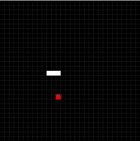

# Snake Game

This is a simple Snake game implemented in Java. The game allows the player to control a snake and eat food to grow longer. The objective is to avoid colliding with the snake's own body or the game boundaries.

## Features
- Classic Snake game mechanics
- Simple and intuitive controls
- Random food generation
- Sound effects for start and eating events

## Installation
1. Clone the repository: `git clone https://github.com/Zephir0g/snake-game.git`
2. Open the project in your preferred Java IDE.
3. Build and run the project.

## Gameplay Instructions
- Use the arrow keys to control the snake's direction: Up, Down, Left, Right.
- Eat the food to grow longer.
- Avoid colliding with the snake's own body or the game boundaries.

## Dependencies
This project uses the `javax.sound:sound` library for playing sound effects. The dependency is managed through Gradle.

## License
This project has no license.

Feel free to contribute and make improvements!!

